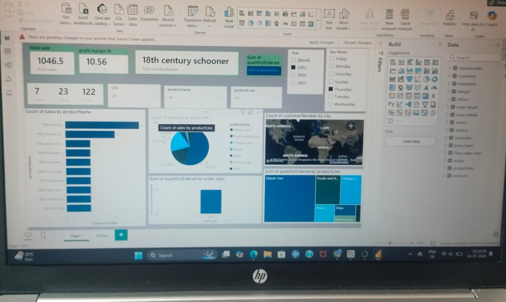

# 📊 Data Analysis Projects Portfolio

Welcome to my Data Analysis repository! This portfolio contains exploratory data analysis (EDA) and visualization projects built using Python, Pandas, and Plotly.

---

## 🚀 Projects Included

### 1. 📱 iPhone Sales Analysis
* **Objective:** Analyze iPhone sales trends, pricing strategies, and customer ratings in the Indian market.
* **Tech Stack:** Python, Pandas, Plotly Express.
* **Key Insights:** Identified price-to-rating dynamics and customer engagement trends across various iPhone models.

### 2. 🎬 Netflix Stock Analysis
* **Objective:** Perform time-series analysis on Netflix stock performance to understand price fluctuations and market behavior.
* **Tech Stack:** Python, Pandas, Data Visualization.

### 3. 💼 Employee Career Survey Analysis
* **Objective:** Analyze workplace survey data to extract insights on employee career growth, satisfaction, and preferences.
* **Tech Stack:** Python, Pandas, Seaborn / Matplotlib.

---

## 🛠️ Tools & Libraries Used
* **Language:** Python
* **Data Manipulation:** Pandas, NumPy
* **Data Visualization:** Plotly Express, Matplotlib, Seaborn
* **Environment:** Jupyter Notebook

### 4. 📊 
* **Objective:** Interactive dashboard analyzing sales trends, profit margins, and regional performance.
* **Tech Stack:** Power BI, DAX, Data Modeling.
* ## 🍕 Pizza Sales Analysis (Power BI Project)

### 📌 Overview
This project provides a detailed analysis of pizza sales data to track key performance indicators (KPIs), understand customer preferences, and optimize sales strategies.

### 📊 Key Insights & Dashboard Features
* **Total Revenue & Orders**: Analyzed total sales, total orders placed, and average order value.
* **Best & Worst Sellers**: Identified top-performing and bottom-performing pizzas by revenue and quantity.
* **Sales Trends**: Evaluated peak hours and busiest days of the week to assist in inventory management.

### 📁 Files Included
* **Dashboard File**: `pizza_sales_power_bi_dashboard.pbix`
* **Dashboard Preview**: `dashboard_preview.png`
* **Datasets**: `orders.csv`, `order_details.csv`, `pizzas.csv`, `pizza_types.csv`, `data_dictionary.csv`

---

